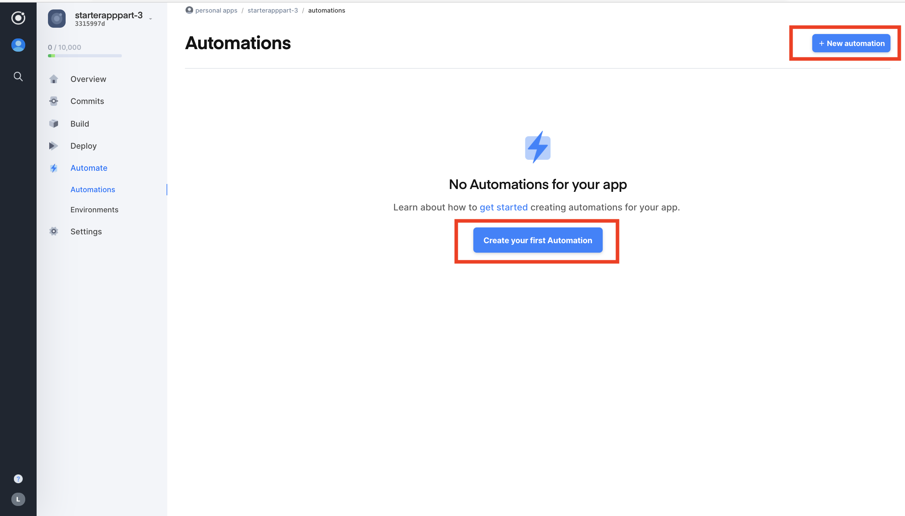
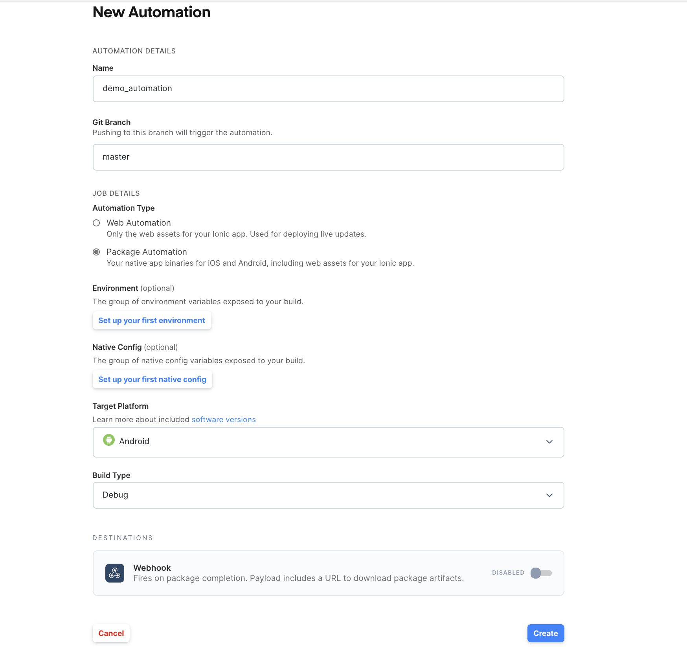
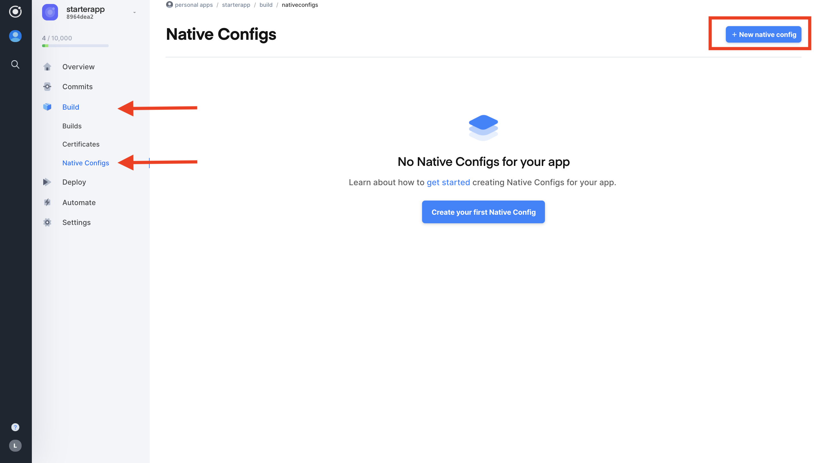
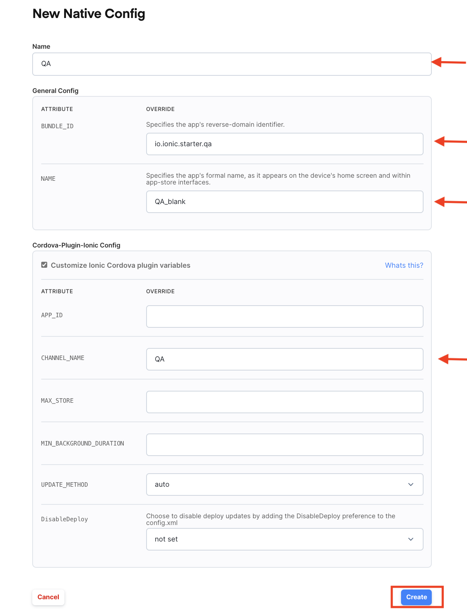
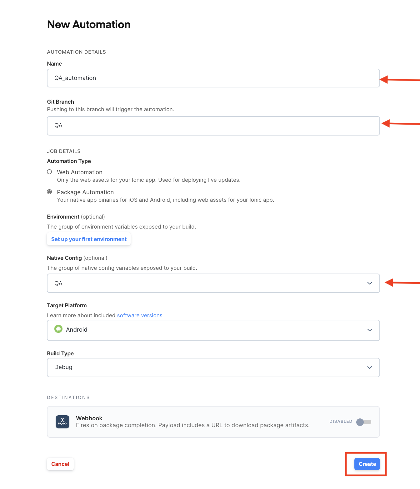
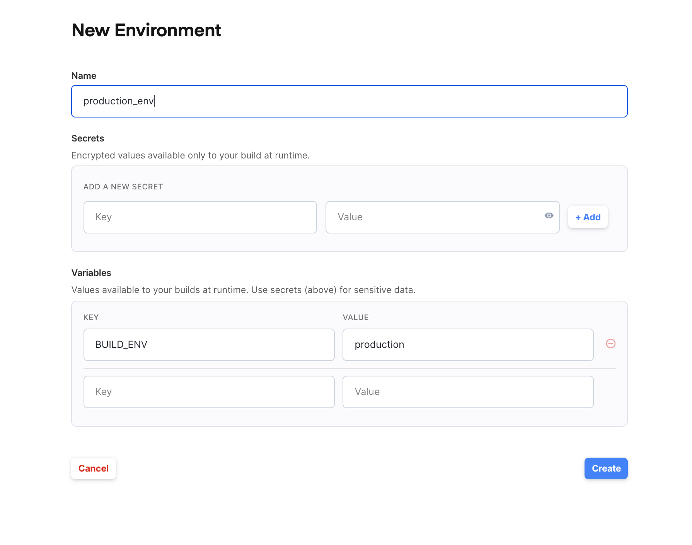
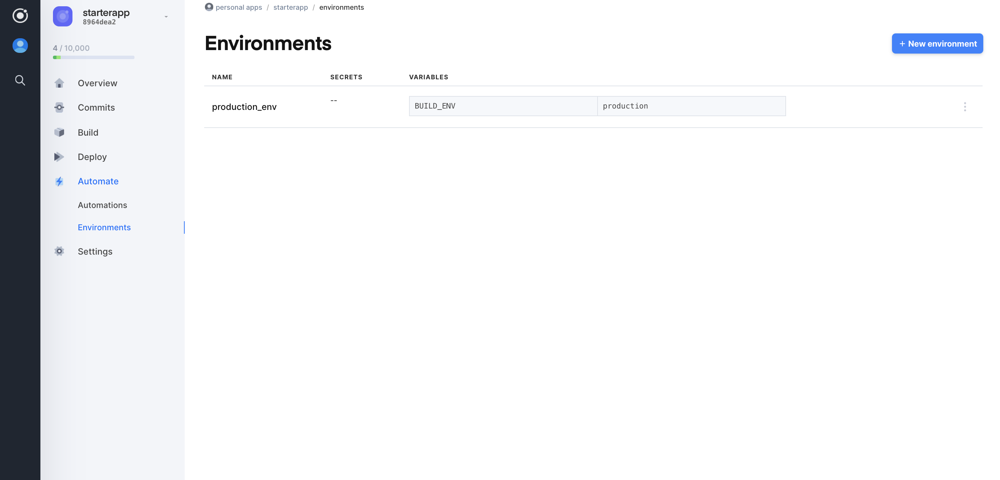
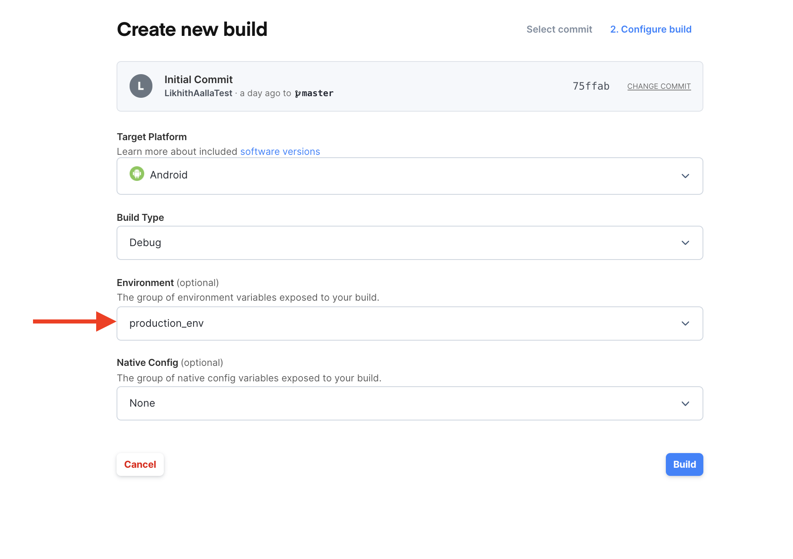

# Exploring Appflow Exercise 5 

This part -5 of the exploring Appflow exercise consists of the following topics (Available for only Growth and above plans

1. Automations
2. Native Configurations
3. Environments

## Automations

<blockquote>
  <p><b>Note:</b>This feature is only available on our <a href="/pricing">Growth plans</a> and above.</p>
</blockquote>

Now that you are well versed with triggering different builds in appflow it's time to automate builds.

You can leverage the automation available in a appflow dashboard to automatically trigger the different builds on commit to you Git.

Automations enable you and your team to utilize the full CI/CD powers of Appflow. You can create automations that trigger package builds and deploy builds every time your team checks in new code to a given branch and you can even configure the automations to use different environments and native configurations so that you can build different versions of your app for development, staging, and production.

### Creating an Automation
Let's create an automation for Android Debug build that you already manually triggered earlier.

Since we were able to successfully build an Android binary using Package, we can now create an automation that triggers an Android Debug build every time a developer pushes code to the development git branch. This way the entire team can easily see when the builds break and track down the exact commit for fast and efficient debugging.

To get started, navigate to the Automate tab within the desired app and click the New Automation button in the top right.



Next, fill in the configuration options:

* **Name:** The name of the automation.
* **Git Branch:** The branch you'd like to trigger the automation from (ex: master). Note: The asterisk (\*) will match anything.
* **Automation Type:**  Since, we are doing automation for android, select Package build.
* **Environments:** You can include any enviroments that can be used by this automations. Donot select any environments for now.
* **Native configuration:** You can include any Native configuration that can be used by this automations. Donot select any Native configuration for now.



### Testing an Automation

Now that the automation is created, any time a developer pushes to the master branch for this application, a new Android Debug type build will automatically start. Simply push a new commit to your master branch to try out the automation.

You can view all the builds associated with a particular automation by navigating to the Automations page in the Appflow Dashboard and clicking the automation from the list.

Try making a trivial change and push to git and the automation should trigger a new build.

## Native Configurations

<blockquote>
  <p><b>Note:</b>This feature is only available on our <a href="/pricing">Growth plans</a> and above.</p>
</blockquote>

Native configs allow you overwrite certain configurations without having to commit changes to version control on a per build/automation basis such as:
* overwrite the unique bundle ID or App ID in [Capacitor configuration](https://capacitorjs.com/docs/basics/configuring-your-app#native-configuration)
* overwrite the App Name as it will appear on the home screen
* overwrite the [Appflow SDK or Deploy Plugin variables and preferences](/docs/appflow/deploy/api#plugin-variables)
* You can also create a native config to set the [DisableDeploy](https://ionicframework.com/docs/appflow/quickstart/deploy#disabling-deploy-for-development) `true` for development and automatically setting it back to `false` when building binaries for release.

### Sample exercise
* Making Staging, QA, and Production versions of you app with different Bundle IDs, App names, and
Deploy Channels so that you can install all the environments on a single device and easily tell the apart. This makes it easy to build your app for multiple environments from the same version of the code.

1. To create a native configuration go to the `Build > Native Configs` tab in the sidebar and click `New native config`.

 <br><br>
2. For QA version of your app Let's do a different Bundle ID, App name, and Deploy Channel so that you can install all the environments on a single device and easily tell the apart

<br><br>

3. Now, you can use this Native Configuration in conjuction with an Automation to create a QA build each and everytime you push a commit to a specfic branch.To create the automation you can enter the branch and simply select QA native config from the drop down.

<br><br>

4. You can also use Native configuration when triggering a  build manually.

  <b>Note:</b> If you plan to use Native Configurations to modify Bundle IDs with your iOS Package builds, you will need to setup code signing credentials using those alternate Bundle IDs. See our section on <a href="/docs/appflow/package/credentials">Generating Credentials</a> for more information.


## Environments

Environments give you a way to customize the build process for your application in order to produce different versions of your applications for different environments from the same code base. All environment variables are accessible to any build scripts that run during the npm run install and npm run build portion of your builds.

There are few pre-defined environment variables that are available for every build. To know more about all the variable and examples on how to use them refer the [Documentation on environments.](https://ionicframework.com/docs/appflow/automation/environments#predefined-environments)


### Custom environments and scripting


<blockquote>
  <p><b>Note:</b>This feature is only available on our <a href="/pricing">Growth plans</a> and above.</p>
</blockquote>

With custom environments it's easy to create and manage custom sets of key/value pairs
to further customize builds on Ionic Appflow. Common use cases include customizing your build process
in order to build staging & QA versions of your app that connect to different APIs
or to build different white labeled versions of your application.
To get started with custom environments, open the app you wish to work on and navigate in the sidebar to
`Automate -> Environments`, then click `New Environment` on the top right. You should see a form like this:

<br><br>

enter the name and key/value pair as shown above.

As can be noticed, there are 2 different sets of environment variables sections that can be utilized:
* Secrets
* Variables

The only difference is that the secrets are hidden and never shown in the dashboard after they have been added, while
the variables are always available to be read.

The environments dashboard also lists available custom environments along with their configured key/value pairs and secrets keys.

<br><br>

Now, let's try modifying the build script in your package.json file to build for prodcution only when certain environment is passed.

```
// customize the build script in the package.json
{
...
     "scripts": {
    "ng": "ng",
    "start": "ng serve",
    "build": "ng build --configuration=$BUILD_ENV",
    "test": "ng test",
    "lint": "ng lint",
    "e2e": "ng e2e"
  },
...
```

Commit the changes made to your package.json file and trigger a new build with the environment added. This should result in a production build of your app.

<br><br>

* You can also add the same environment in your automations and in addtion to Native configurations as well to futher enhance your CI/CD capabilities.
* You can also try replacing the build script with your own bask script that triggers builds based on pre-defined environments. Refer [here](https://ionicframework.com/docs/appflow/automation/environments#usage)

Reference: https://indepth.dev/becoming-an-angular-environmentalist/

You can use this repository to compare your starter project and make changes if necessary.

If you are facing any issues or need help understanding any of these concepts [contact support](support@ionic.io)


